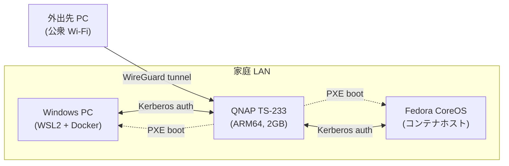

# homelab-setup

[](./LICENSE)
[](./docs/overview.md)
[]()

**QNAP TS-233 (ARM64) + Windows + Fedora Atomic** を組み合わせた自宅 homelab の設計 / 構築リポジトリ。

「家にあるすべての PC を同じ ID でログオン可能にし、壊れたらネット経由で 10 分で復元できる」状態をゴールに、段階的に構築する。

---

## 📐 全体像



| ノード | 役割 |
|--------|------|
| QNAP TS-233 | Kerberos KDC / DNS / LDAP / PXE / WireGuard 終端 (中央サーバ) |
| Windows PC | デスクトップ + 開発機 (WSL2 + Docker) |
| Fedora CoreOS | 追加コンテナホスト (将来) |
| 外出先 PC | WireGuard 経由で帰宅トンネル |

---

## 🗺️ ロードマップ

| Phase | テーマ | モジュール | 状態 |
|-------|-------|----------|------|
| 1 | Windows 基盤 (WSL2 + Docker + buildx) | `setup-homelab.ps1` | ✅ 完了 |
| 2 | Kerberos ID 統合 + MFA (パスワード / 指紋 / YubiKey) | [`modules/kerberos/`](./modules/kerberos/) | 🚧 設計中 |
| 2.x | WireGuard Road Warrior トンネル | [`modules/wireguard/`](./modules/wireguard/) | 🚧 設計中 |
| 3 | PXE / ネットブート OS 復元 | [`modules/pxe/`](./modules/pxe/) | 🚧 設計中 |
| 4 | 自動更新ポリシー (zincati / WUfB / Renovate) | [`modules/autoupdate/`](./modules/autoupdate/) | 🚧 設計中 |
| 5 | 監視 / Web SSO / バックアップ高度化 | 未モジュール化 | 🗓 計画中 |
| 6 | HA / セカンダリ KDC / オフサイトバックアップ | 未モジュール化 | 🗓 計画中 |

詳細は [`docs/overview.md`](./docs/overview.md) を参照。

---

## 🚀 クイックスタート (Phase 1)

Windows ホスト側に WSL2 + Docker Desktop + buildx を 1 行で導入する。

**管理者 PowerShell** で:

```powershell
iex (irm https://raw.githubusercontent.com/nagata1634/homelab-setup/main/setup-homelab.ps1)
```

実行中に **自動で 2 回再起動** し、Task Scheduler 経由で続行する (所要 20〜40 分)。

| Stage | 主な処理 | 再起動 |
|-------|---------|--------|
| 1 | VirtualMachinePlatform / WSL / HypervisorPlatform 有効化 + `wsl --install --no-distribution` | あり |
| 2 | Ubuntu-24.04 を `--no-launch` で登録、Docker Desktop サイレントインストール | あり |
| 3 | Docker engine 起動待ち、`hello-world`、`binfmt --install all`、buildx multi-arch 検証 | なし |

完了後、デスクトップに `homelab-docs\` と `homelab-setup-result.txt` が置かれる。

### 中断・再開
状態は `C:\ProgramData\homelab-setup\state.json` に保存される。失敗時は同じワンライナーを再実行すれば中断点から再開する (idempotent)。

### ログ
- 実行ログ: `C:\ProgramData\homelab-setup\setup.log`
- PowerShell transcript: `C:\ProgramData\homelab-setup\transcript.log`

### 既知の制約
- Docker Desktop は `--accept-license --quiet` でサイレント導入するが、初回起動時にバージョンによっては「Use recommended settings」ダイアログが出る場合あり (OK を 1 回押せば続行)。
- 対象 OS: Windows 10 21H2 (build 19044) 以上 / Windows 11 (Home edition 可)。

### ⚠ セキュリティ
`iex (irm ...)` 形式 (curl-pipe) は **取得した内容をそのまま管理者で実行** する。実行前に GitHub 上で [`setup-homelab.ps1`](./setup-homelab.ps1) を必ず目視確認すること。フォークして自分の repo の raw URL を使う運用が最も安全 (フォーク後は冒頭の `$Script:SelfUrl` を自分の raw URL に書き換える)。

---

## 📦 リポジトリ構成

```
homelab-setup/
├── README.md                  ← 本書
├── LICENSE                    ← MIT
├── setup-homelab.ps1          ← Phase 1 セットアップ
├── add-neovim.ps1             ← Phase 1 補助
├── versions.yml               ← 各モジュールのタグ pin
├── docs/
│   ├── overview.md            ← 全体設計 / 依存関係 / グローバル設計パラメータ
│   └── glossary.md            ← 用語集 (Kerberos / PKINIT / GSSAPI 等)
└── modules/
    ├── kerberos/              ← Samba AD DC + step-ca + MFA
    ├── wireguard/             ← Road Warrior トンネル
    ├── pxe/                   ← iPXE + FCOS/Win 配信
    └── autoupdate/            ← zincati / WUfB / Renovate
```

各 `modules/<name>/` は **独立 repo として切り出し可能** な自己完結レイアウト。
切り出し例:
```bash
git subtree split --prefix=modules/kerberos -b split-kerberos
git push git@github.com:<owner>/homelab-kerberos.git split-kerberos:main
```

---

## 🎯 設計原則

1. **ID は KDC に集約** — マシンは状態を持たず、KDC + LDAP + CA がすべての真実 (single source of truth)。
2. **マシンは使い捨て** — 壊れたら PXE で 10 分で再構築。状態はホームディレクトリと KDC に寄せる。
3. **自動更新前提** — 手動メンテゼロを目指し、ロールバック可能な更新機構 (ostree / WUfB) を採用。
4. **疎結合モジュール** — 各モジュールは独立 repo に切り出せる粒度で設計。
5. **公開可能な品質** — 設計判断は理由とトレードオフを明文化、内部固有値は TBD で外部化。

---

## 🤝 コントリビューション

Issue / PR を歓迎します。設計判断 (Open Design Decisions) は各モジュールの `docs/requirements.md` 末尾に記載しているので、議論はそちらで。

---

## 📄 ライセンス

MIT — [LICENSE](./LICENSE) を参照。
