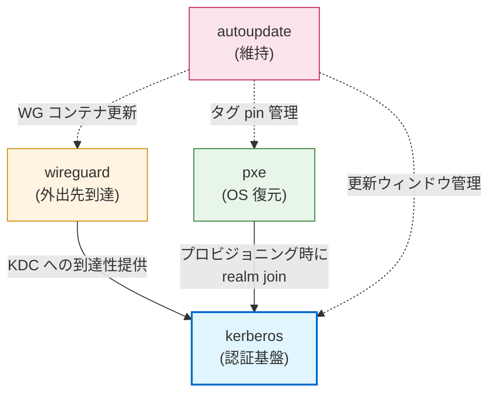
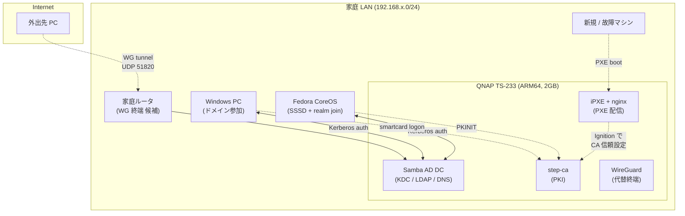
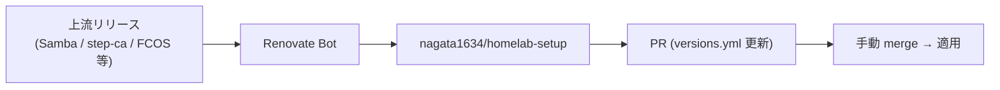

# Homelab 全体設計

QNAP TS-233 (ARM64) + Windows + Fedora Atomic を前提とした自宅 homelab の設計書。
個別モジュールの詳細は各 `modules/<name>/docs/requirements.md` を参照。

---

## 1. 目的と原則

### 1.1 目的
- 家庭内の **すべての PC / サーバを同一 ID で利用** できる状態を実現する。
- **OS が壊れても 10 分で復元** できる仕組みを持つ。
- 手動メンテをほぼゼロにし、**自動更新 + ロールバック** で運用する。
- 外出先からも自宅 LAN と同じ体験で作業できる。

### 1.2 設計原則
1. **状態は中央に集約** — マシン固有の状態を最小化し、KDC + LDAP + CA を真実の源とする。
2. **マシンは使い捨て** — PXE 復元前提。物理マシンは「KDC への端末」として扱う。
3. **自動更新を信頼する** — ostree / WUfB のロールバック性を信じ、人手介入を減らす。
4. **モジュール疎結合** — 独立 repo に切り出せる粒度で設計、依存は明示。
5. **設計判断は文書化** — トレードオフと採用理由を残す (Open Design Decisions)。

---

## 2. モジュール構成

| モジュール | 目的 | 状態 | 場所 |
|----------|-----|------|------|
| [**kerberos**](../modules/kerberos/) | Win/Linux ユーザ認証一元化 (Samba AD DC + step-ca + MFA) | 設計中 v0.4 | `modules/kerberos/` |
| [**wireguard**](../modules/wireguard/) | 外出先からの帰宅トンネル | 設計中 v0.1 | `modules/wireguard/` |
| [**pxe**](../modules/pxe/) | OS ネットブート復元 + Kerberos 自動 join | 設計中 v0.1 | `modules/pxe/` |
| [**autoupdate**](../modules/autoupdate/) | OS / コンテナ自動更新 | 設計中 v0.1 | `modules/autoupdate/` |

各モジュールは将来的に独立 repo (`nagata1634/homelab-<name>`) として切り出すことを想定したレイアウト。
`git subtree split --prefix=modules/<name> -b split-<name>` で履歴を保ったまま抽出可能。

---

## 3. 依存関係

| From → To | 依存内容 |
|-----------|---------|
| wireguard → kerberos | 外出先クライアントの DNS / KDC 到達性確保 |
| pxe → kerberos | プロビジョニング時の自動 realm join (Ignition / unattend に CA 証明書を埋め込み) |
| autoupdate → kerberos | KDC の自動更新は他より遅らせる (循環停止回避) |
| autoupdate → pxe | コンテナ tag pin 管理 |
| autoupdate → wireguard | WG コンテナの更新 |

---

## 4. 物理 / 論理アーキテクチャ

| ホスト | 役割 | OS / コンテナ |
|--------|------|--------------|
| QNAP TS-233 | 中央サーバ | QTS + Container Station (Debian/Ubuntu ARM64) |
| Windows PC | デスクトップ | Windows 10/11 (ドメイン参加) |
| Fedora CoreOS | コンテナホスト | Fedora CoreOS (SSSD で realm join) |
| 外出先 PC | リモート | Windows / Linux / モバイル |

---

## 5. グローバル設計パラメータ

各モジュール共通の命名 / ネットワーク設計。各モジュールの設計パラメータ表はここを参照する。

| 項目 | 暫定値 | 確定状態 |
|------|-------|---------|
| Kerberos Realm | `HOME.LAB` | 🔲 暫定 |
| DNS Domain | `home.lab` | 🔲 暫定 |
| NetBIOS Name | `HOMELAB` | 🔲 暫定 |
| LAN サブネット | (運用者が決定) | 🔲 未定 |
| KDC ホスト名 | `kdc01.home.lab` | 🔲 暫定 |
| PXE next-server | `kdc01.home.lab` (TS-233 同居) | 🔲 暫定 |
| WG エンドポイント | (運用者が決定: ルータ or TS-233) | 🔲 未定 |
| WG UDP ポート | `51820` (デフォルト) | 🔲 暫定 |
| WG サブネット | (運用者が決定。LAN と重複しない RFC1918 帯) | 🔲 未定 |
| FCOS ストリーム | `stable` | ✅ 確定 |

> 公開時は実環境の値に置換し、暫定値はサンプルとして残すこと。

---

## 6. リリース / バージョン管理

各モジュールのリリースタグ / コンテナイメージタグは [`versions.yml`](../versions.yml) で集中 pin。
Renovate により PR ベースで更新提案を受ける運用 (詳細は [autoupdate モジュール](../modules/autoupdate/))。

---

## 7. セキュリティモデル (要約)

| レイヤ | 仕組み |
|--------|-------|
| ユーザ認証 | Kerberos (パスワード / 指紋 / YubiKey PKINIT) |
| 認可 | AD グループ + SSSD HBAC ライク (sudo は AD グループで集中管理) |
| 通信路暗号化 (LAN) | Kerberos のサービス毎暗号 (krb5p 等) + TLS |
| 通信路暗号化 (外出) | WireGuard (UDP 51820) |
| PKI 信頼 | step-ca (intermediate のみオンライン、root はオフライン) |
| 監査 | KDC ログ + Windows イベントログ (30 日保存) |
| バックアップ | 日次スナップショット 7 日 + 月次オフサイト (Phase 6) |

詳細は各モジュールの NFR セクションを参照。

---

## 8. 用語集

主要な略語と用語は [`docs/glossary.md`](./glossary.md) を参照。

---

## 9. 参考資料

- [Samba AD DC HOWTO](https://wiki.samba.org/index.php/Setting_up_Samba_as_an_Active_Directory_Domain_Controller)
- [FreeIPA Documentation](https://www.freeipa.org/page/Documentation)
- [MIT Kerberos Documentation](https://web.mit.edu/kerberos/krb5-latest/doc/)
- [Fedora CoreOS](https://docs.fedoraproject.org/en-US/fedora-coreos/)
- [zincati](https://github.com/coreos/zincati)
- [WireGuard Whitepaper](https://www.wireguard.com/papers/wireguard.pdf)
- [iPXE Documentation](https://ipxe.org/docs)
- [step-ca](https://smallstep.com/docs/step-ca/)
- [PKINIT RFC 4556](https://www.rfc-editor.org/rfc/rfc4556)

---

## 10. 改版履歴

| 日付 | 版 | 変更点 |
|------|----|--------|
| 2026-05-29 | v0.1 | 初版 (モジュール分離) |
| 2026-05-29 | v0.2 | 公開品質向上 (Mermaid 図 / セキュリティモデル / 参考資料追加) |
