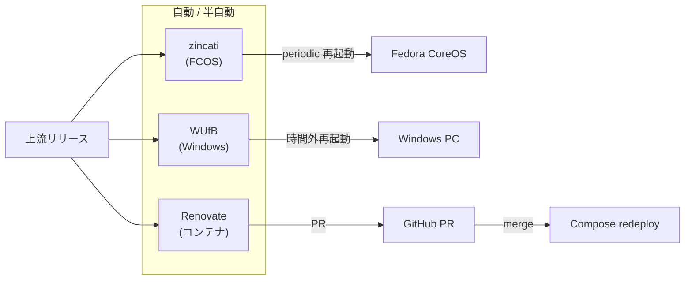

# homelab-autoupdate


各 OS / コンテナの **自動更新ポリシー**。Fedora CoreOS の zincati、Windows Update for Business、
コンテナの Renovate ベース PR 更新を統合管理する。

- 📄 詳細要件: [`docs/requirements.md`](./docs/requirements.md)
- 🗺️ 全体像: [`../../docs/overview.md`](../../docs/overview.md)

---

## ✨ 提供価値

| 効果 | 内容 |
|------|------|
| パッチ適用遅延ゼロ化 | リリース公開から 7 日以内に自動追従 |
| 手動メンテゼロ | 平時の運用作業を不要に |
| ロールバック保証 | ostree / Windows 「以前のビルドに戻す」で復旧 |
| 更新の集中可視化 | 単一のポリシー定義 + ダッシュボード |

## 🏗️ 更新フロー



## 📦 想定ディレクトリ構成

```
modules/autoupdate/
├── README.md
├── docs/
│   ├── requirements.md
│   └── runbook.md            (rollback 手順、将来)
├── fcos/
│   ├── zincati-config.toml   (periodic 戦略テンプレ)
│   └── pre-reboot-hook.sh    (KDC バックアップ等)
├── windows/
│   └── WUfB-policy.admx
├── containers/
│   └── renovate.json5
└── monitoring/
    └── update-alert.yml
```

## 🚦 ステータス

- 要件定義: **v0.2** (公開品質)
- 実装: 未着手
- 次のマイルストーン: Renovate 設定の repo 適用

## 🔗 関連モジュール

- 全モジュールに横断的に影響 (更新ウィンドウ調整)
- 特に [kerberos](../kerberos/) の KDC は他より遅らせる
