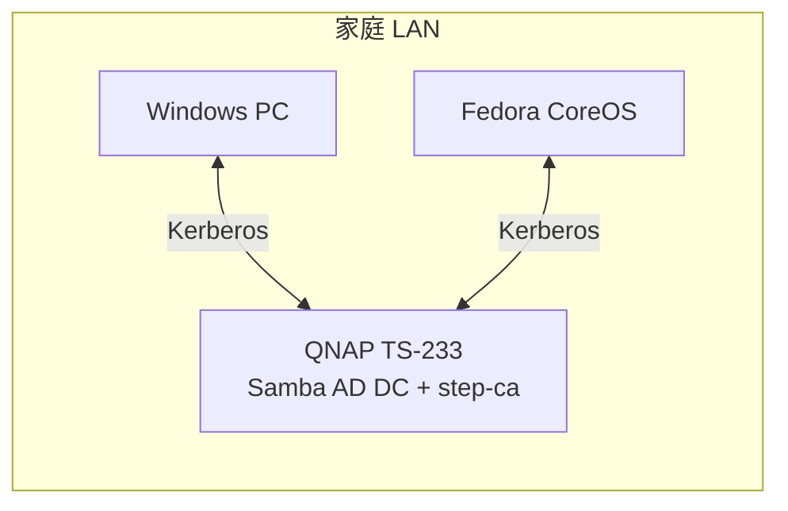

# homelab-kerberos


QNAP TS-233 (ARM64) 上に **Samba AD DC** を構築し、Windows / Linux のユーザ認証を統一する。
パスワード / 指紋 / ハードウェアセキュリティキーの 3 方式をサポート。

- 📄 詳細要件: [`docs/requirements.md`](./docs/requirements.md)
- 🗺️ 全体像: [`../../docs/overview.md`](../../docs/overview.md)
- 📖 用語集: [`../../docs/glossary.md`](../../docs/glossary.md)

---

## ✨ 提供価値

| 効果 | 内容 |
|------|------|
| 単一 ID | 家庭内の全 PC で同じユーザ名 / パスワードを使用可能 |
| パスワード変更の伝播 | 1 箇所変更すれば全マシンに即時反映 |
| MFA 対応 | ハードウェアキー (PIV / FIDO2) + 指紋ローカルアンロックの組み合わせ |
| sudo 一元管理 | AD グループで全 Linux ホストの権限を集中制御 |
| Kerberize 拡張可能 | SSH / NFS / SMB / Web SSO 等への将来拡張余地 |

## 🏗️ アーキテクチャ



## 📦 想定ディレクトリ構成

```
modules/kerberos/
├── README.md
├── docs/
│   ├── requirements.md
│   ├── architecture.md   (将来)
│   └── runbook.md        (将来)
├── compose/
│   ├── samba-ad-dc.yml
│   └── step-ca.yml       (PIV 採用時)
├── provision/
│   ├── provision-domain.sh
│   ├── issue-host-cert.sh
│   └── enable-pkinit.sh  (PIV 採用時)
└── clients/
    ├── windows/
    │   ├── join-domain.ps1
    │   └── enable-smartcard-logon.ps1
    ├── linux/
    │   ├── realm-join.sh
    │   ├── setup-fprintd.sh
    │   └── ssh-gssapi.sh
    └── hwkey/
        └── provision.sh
```

## 🚦 ステータス

- 要件定義: **v0.5** (公開品質)
- 実装: 未着手
- 次のマイルストーン: KDC 採用方式の最終確定 → ARM64 PoC

## 🔗 関連モジュール

- [wireguard](../wireguard/) — 外出先からの KDC 到達性を提供
- [pxe](../pxe/) — プロビジョニング時の自動 realm join
- [autoupdate](../autoupdate/) — KDC の更新ウィンドウ管理
