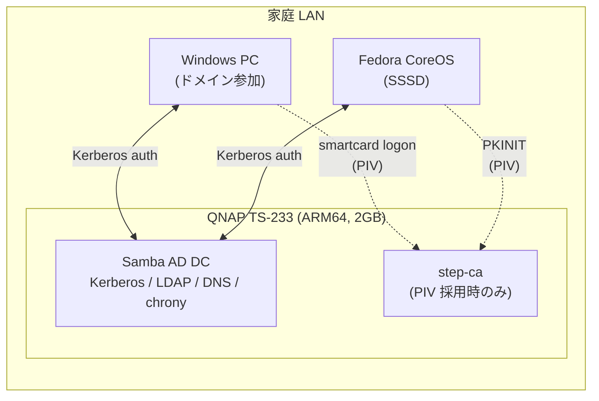

# Kerberos モジュール 要件定義書

最終更新: 2026-05-29 / ステータス: ドラフト v0.4

> 全体像とグローバル設計パラメータは [`../../../docs/overview.md`](../../../docs/overview.md) を参照。

---

## 1. 目的

- **シングルサインオン基盤 (Kerberos KDC) を中心に、Windows / Linux のユーザ認証を一元化** する。
- 同一ユーザ名 / パスワードで各マシンへログオン / SSH / SMB アクセスを可能にする。
- パスワード / 指紋 / YubiKey の 3 認証方式をサポートし、管理者は YubiKey 必須化できる。
- 将来 Web サービス (Nextcloud, Grafana 等) も同 ID に統合できる素地を作る。

## 2. 依存

| 種別 | 依存先 | 内容 |
|------|-------|------|
| 提供 | wireguard | 外出先からの KDC 到達性 |
| 提供 | pxe | プロビジョニング時の realm join (CA 証明書配信) |
| 受領 | autoupdate | KDC の更新ウィンドウ管理 |
| 外部 | NTP (chrony) | スキュー ≤ 5 分が Kerberos の前提 |
| 外部 | DNS | SRV レコード必須 (Samba AD 内蔵 DNS で提供) |

## 3. 認証方式

3 つの方式をサポートし、利用者は環境に応じて使い分け / 組み合わせ可能。

| # | 方式 | 利用シーン | Kerberos との結合 |
|---|------|-----------|------------------|
| 1 | **パスワード** | リモート SSH、サーバ初期セットアップ、フォールバック | 標準 Kerberos preauth (ENC-TIMESTAMP) |
| 2 | **指紋** | デスクトップ / ノート PC ロック解除 | Windows Hello / fprintd が TPM 内キャッシュをアンロック → PAM 経由で `kinit` |
| 3 | **ハードウェアセキュリティキー** | 高セキュリティ、リモート強認証、MFA | 採用モデルにより 2 つの結合方式 (下記 §3.1 参照) |

> 指紋は **ローカルアンロック手段**。データはネットワークに出ない。Kerberos プロトコル自体は指紋を理解しないため「指紋でローカル PAM を通過 → 裏で `kinit`」の構図になる。

### 3.1 ハードウェアキーの結合方式

ハードウェアキーには大きく 2 系統があり、それぞれ Kerberos との結合方式が異なる。**採用するキーの種別によって設計が分岐** する。

| 系統 | 代表的な機能 | Kerberos 結合 | 必要条件 |
|------|------------|--------------|---------|
| **A. PIV (スマートカード) 対応キー** | X.509 証明書を内蔵チップに格納、PKCS#11 経由で利用 | **PKINIT** (Kerberos 標準、RFC 4556) | キーが PIV applet を実装、CA の整備 |
| **B. FIDO2 / WebAuthn 専用キー** | 公開鍵チャレンジレスポンス、PIN + ユーザ存在証明 | **間接結合** (下記参照) | キーが FIDO2 / U2F を実装 |

#### A. PIV / PKINIT 経路 (直接結合)
- Windows: スマートカードログオン (`certutil -dspublish` で AD NTAuth に CA 登録)
- Linux: `kinit -X X509_user_identity=PKCS11:...` で TGT 取得
- 失効: CA で証明書失効 → CRL / OCSP 反映
- ◎ Kerberos プロトコルにネイティブ統合
- △ CA 構築 / 証明書ライフサイクル管理が必要

#### B. FIDO2 経路 (間接結合)
FIDO2 は Kerberos プロトコルが直接サポートしないため、以下のいずれかでブリッジする:

| 経路 | 仕組み | 適用範囲 |
|------|-------|---------|
| **B-1. PAM + pam-u2f / libfido2** | PAM 認証成功後に保存資格情報で `kinit` を実行 | Linux ローカルログオン / SSH |
| **B-2. SSH FIDO2 鍵** (`ed25519-sk`) | OpenSSH ネイティブ。Kerberos バイパス | SSH 専用 (Kerberos 統合せず) |
| **B-3. WebAuthn → OIDC ブリッジ** | Keycloak / Authentik 経由で FIDO2 → SAML/OIDC → Kerberos | Web サービス |
| **B-4. Windows Hello for Business** | FIDO2 → Entra ID → AD ハイブリッド | Entra ID 連携前提 (本 homelab スコープ外) |

#### 設計上の含意
- **PIV 系を採用する場合**: 本書の機能要件 FR-09 (`kinit -X`) / FR-12 (管理者 PIV 必須) がそのまま適用可能。CA (step-ca) が必須。
- **FIDO2 系を採用する場合**: FR-09 は B-1 (PAM 経由 kinit) に読み替え。CA は不要だが、PAM 設定とフォールバック設計を厳密に行う必要がある。Web サービスへの拡張は Phase 5 で別途検討。
- **両系統を混在運用する場合**: ユーザ単位で方式を選べるよう PAM / kadm5.acl を分岐させる。

## 4. スコープ

### 4.1 In Scope
| ID | 項目 | 内容 |
|----|------|------|
| S1 | KDC 構築 | TS-233 上 Container Station の Debian/Ubuntu ARM64 コンテナ |
| S2 | LDAP | UID/GID/homeDir/shell 等 POSIX 属性 |
| S3 | DNS | 正引き / 逆引き / SRV (Samba AD 内蔵 DNS) |
| S4 | 時刻同期 | chrony を全ノードに導入 |
| S5 | Linux クライアント統合 | SSSD で Fedora / WSL Ubuntu を join |
| S6 | Windows クライアント統合 | ネイティブドメイン参加 |
| S7 | バックアップ | DB / LDAP / keytab の日次バックアップ |
| S8 | PKI (PIV 採用時) | step-ca による CA 構築 (KDC / クライアント証明書) |
| S9 | PKINIT (PIV 採用時) | ハードウェアキーからの TGT 取得経路 |
| S9' | PAM 経由 kinit (FIDO2 採用時) | pam-u2f / libfido2 → kinit ラッパー |
| S10 | 指紋連携 | Windows Hello / fprintd の PAM 設定 |
| S11 | MFA ポリシー | 管理者にハードウェアキー認証を強制可能 |

### 4.2 Out of Scope (将来 Phase へ)
- マルチ KDC / セカンダリ DC (HA)
- Windows AD との双方向トラスト
- Web SSO (SPNEGO) — Phase 5
- Kubernetes OIDC 統合

## 5. 採用方式の選択 (TBD-1)

| 観点 | A. Samba AD DC | B. FreeIPA | C. MIT + OpenLDAP |
|------|---------------|-----------|--------------------|
| Windows 統合 | ◎ ネイティブ参加 | △ AD トラスト経由 | △ 手動 |
| Linux 統合 | ○ SSSD | ◎ SSSD ネイティブ | ○ SSSD |
| PKINIT (YubiKey) | ○ CA 別建て | ◎ 内蔵 Dogtag CA | ○ CA 別建て |
| OTP | △ 外部連携 | ◎ 内蔵 | △ pam_oath |
| ARM64 | ○ | △ 要検証 | ◎ |
| RAM 消費 | ~500MB | ~1.5GB (TS-233 不可) | ~100MB |
| 推奨 | **◎** | ○ (要別ホスト) | ○ (学習向け) |

### 暫定推奨: **A. Samba AD DC + step-ca**
- Windows をシームレスにドメイン参加できる点が決定的。
- TS-233 の 2GB RAM でも Samba AD DC 単体なら現実的。
- YubiKey PKINIT 用 CA は step-ca (ARM64 対応、~50MB) を別コンテナで併設。

## 6. 想定アーキテクチャ



## 7. 機能要件

| ID | 要件 | 受け入れ基準 |
|----|------|------------|
| FR-01 | 単一 ID で Windows ログオン | `alice@HOME.LAB` でサインイン成功 |
| FR-02 | 単一 ID で Linux SSH | `ssh alice@fedora.home.lab` 成功、`id` で AD UID/GID 表示 |
| FR-03 | パスワード変更即時反映 | `kpasswd` or Win Ctrl+Alt+Del 変更が他ノードに反映 |
| FR-04 | パスワードポリシー強制 | 最小長 / 履歴 / 期限を AD ポリシーで適用 |
| FR-05 | ユーザ追加 CLI/GUI | `samba-tool user add` および RSAT で成功 |
| FR-06 | GSSAPI SSH | `kinit` 後 `ssh -K` 成功 |
| FR-07 | ホームディレクトリ自動作成 | mkhomedir で初回ログイン時に作成 |
| FR-08 | ハードウェアキーで Win ログオン | (PIV) スマートカードログオン成功 / (FIDO2) WebAuthn ログオン成功 |
| FR-09 | ハードウェアキーで Linux ログオン → TGT 取得 | (PIV) `kinit -X X509_user_identity=PKCS11:...` / (FIDO2) PAM 通過後 `kinit` 実行 |
| FR-10 | 指紋で Win サインイン | Windows Hello → 裏で TGT 取得 |
| FR-11 | 指紋で Linux ログオン | fprintd → PAM 経由 kinit で TGT 取得 |
| FR-12 | 管理者にハードウェアキー必須化可能 | パスワードのみでの TGT 取得不可ポリシー |
| FR-13 | ハードウェアキー失効 | (PIV) 証明書失効 → CRL/OCSP / (FIDO2) credential ID を AD 属性から削除 |

## 8. 非機能要件

| ID | カテゴリ | 要件 |
|----|---------|------|
| NFR-01 | 可用性 | KDC 停止時の新規ログオン不可は許容。既セッションは継続 |
| NFR-02 | 性能 | 認証応答 ≤ 500ms (LAN 内) |
| NFR-03 | 時刻精度 | 全ノードスキュー ≤ 5 分 |
| NFR-04 | バックアップ | 日次スナップショット、7 日保存 |
| NFR-05 | 復旧 | バックアップから 1 時間以内に再構築 |
| NFR-06 | セキュリティ | AES256-CTS-HMAC-SHA1-96 を最低限、RC4/DES 無効 |
| NFR-07 | 監査 | ログオン成功/失敗を 30 日保存 |
| NFR-08 | 運用 | 全設定 Git 管理、IaC で再現可能 |
| NFR-09 | PKI 有効期間 (PIV 採用時) | KDC=1 年、ユーザ証明書=90 日 (短命) |
| NFR-10 | ハードウェアキー PIN | 8 桁以上、3 回失敗でロック |
| NFR-11 | 指紋 | テンプレートはローカル TPM / Secure Enclave 内に閉じる |
| NFR-12 | リボーク所要時間 | 紛失報告 ≤ 1 時間で失効反映 (PIV: CRL 配布 30 分間隔 / FIDO2: AD 属性即時削除) |

## 9. 認証フロー

### パスワード
```
User → Client PAM → (AS-REQ + PA-ENC-TIMESTAMP) → KDC
                ← (TGT) ←
```

### 指紋 (Win Hello / fprintd)
```
指紋 → TPM/Secure Enclave → 保護パスワード解放 → PAM が裏で AS-REQ → TGT
```

### ハードウェアキー — PIV / PKINIT (採用パターン A)
```
PIN → PIV applet スロット 9a 秘密鍵で署名
   → AS-REQ (PA-PK-AS-REQ, クライアント証明書同梱)
   → KDC が CA 信頼 + CRL 確認 → TGT
```

### ハードウェアキー — FIDO2 (採用パターン B)
```
PIN + Touch → FIDO2 チャレンジ署名
   → PAM (pam-u2f / libfido2) が AD 属性内の credential ID で検証
   → 認証成功後、PAM 設定により kinit (保存パスワード or kcm) → TGT
```

## 10. 制約と前提

- TS-233 RAM 2GB のため AD DC 単体運用 (重い追加は別ホスト)。
- Samba AD DC は QTS Container Station 上の Debian/Ubuntu ARM64 コンテナとして稼働。
- DNS は Samba AD 内蔵を使用 (BIND9_DLZ ではなく)。
- Fedora Atomic ホストは未調達前提、Windows + TS-233 から開始。
- LAN 内部のみで完結、外部公開なし (外出時アクセスは wireguard モジュール経由)。

## 11. リスクと対策

| # | リスク | 対策 |
|---|-------|------|
| R1 | KDC 単一障害点 | 日次バックアップ + Runbook。Phase 6 でセカンダリ |
| R2 | 時刻ずれ | 全ノード chrony 必須 |
| R3 | DNS SRV 設定ミス | 構築前に dig 確認をチェックリスト化 |
| R4 | Win ドメイン参加でプロファイル消失 | 事前バックアップ / 移行手順 |
| R5 | QNAP Container Station ネットワーク制約 | host or macvlan で固定 IP、PoC 検証 |
| R6 | ARM64 Samba 動作不確実 | PoC で smoke test (`samba-tool domain provision`) |
| R7 | ハードウェアキー紛失 → 締め出し | バックアップキー 1 本必須、リカバリパスワードを紙で金庫保管 |
| R8 | CA 秘密鍵漏洩 (PIV 採用時) | root key は HSM or オフライン保管、intermediate のみオンライン |
| R9 | 指紋センサ故障 | パスワード / ハードウェアキーへフォールバック維持 |
| R10 | PKINIT/PAM 設定ミスで全員ロックアウト | `kadmin.local` ローカル経路 + パスワードフォールバックを残す |
| R11 | Win スマートカード NTAuth 未登録 (PIV 採用時) | `certutil -dspublish` を構築手順に必須化 |
| R12 | 採用キーが期待した方式に非対応 | 調達前に PIV / FIDO2 対応状況を確認する手順を Runbook 化 |

## 12. モジュール固有の設計パラメータ

(グローバルパラメータは `docs/overview.md` 参照)

| 項目 | 暫定値 | TBD |
|------|-------|-----|
| 管理者 UPN | `admin@HOME.LAB` | |
| 初期ユーザ | TBD | ✓ TBD-4 |
| バックアップ保管先 | TBD (TS-233 内 / 外付け USB / クラウド) | ✓ TBD-5 |
| WSL2 を AD 参加させるか | TBD | ✓ TBD-6 |
| ハードウェアキー モデル | (運用者が選定、要件次第で PIV 対応モデル or FIDO2 専用モデル) | ✓ |
| ハードウェアキー 本数 | プライマリ + バックアップ = 2 本/人 推奨 | |
| CA 配置 | (運用者が決定) | ✓ |
| パスワード認証廃止 | (運用者が決定: フォールバック維持 or MFA 強制) | ✓ |

## 13. Kerberize 可能な周辺機能 (将来取り込み)

KDC を立てると **同じ ID で透過的に使える** ようになる機能群。Phase 2.x / Phase 5 で順次取り込み。

### 13.1 ◎ 標準的に Kerberize 可能
| # | 機能 | 統合方式 | 効果 |
|---|------|---------|------|
| K-01 | SSH GSSAPI | `GSSAPIAuthentication yes` + host keytab | `kinit` 1 回で全 Linux にパスワードレス SSH |
| K-02 | NFSv4 (krb5p) | `sec=krb5p` | LAN ファイル共有を盗聴・改ざん耐性付きで |
| K-03 | SMB/CIFS | Samba AD 標準 | Win/macOS/Linux 全てから同一資格で |
| K-04 | HTTP SPNEGO | `mod_auth_gssapi` / `spnego-http-auth` | Grafana/Gitea 等で自動ブラウザ SSO |
| K-05 | PostgreSQL / MariaDB | `gss` 認証 | パスワードレス DB 接続 |
| K-06 | LDAP | Samba AD 内蔵 | アプリ認証バックエンド |
| K-07 | **sudo 集中管理** | SSSD + AD グループ | 全 Linux の sudoers を一元管理 |
| K-08 | WinRM / PS Remoting | Kerberos 既定 | パスワードレス Win 管理、Ansible WinRM |
| K-09 | RDP (NLA) | ドメイン参加で自動 | RDP が SSO 化 |
| K-10 | CIFS マウント (Linux) | `mount.cifs sec=krb5` | Linux で Samba 共有自動マウント |
| K-11 | DNS 動的更新 (GSS-TSIG) | Samba AD 内蔵 | クライアント起動時に自分の A レコード安全登録 |

### 13.2 ○ 半 Kerberize / SSO 化
| # | 機能 | 方式 |
|---|------|------|
| K-20 | Gitea / GitLab / Jenkins / Grafana / Nextcloud / Vaultwarden | LDAP + SPNEGO |
| K-21 | Jupyter / VS Code Server | SSH GSSAPI or SPNEGO リバプロ |
| K-22 | CUPS | Kerberos 認証 |
| K-23 | IMAP / SMTP | GSSAPI SASL |
| K-24 | Kubernetes | OIDC 経由 (Keycloak ブリッジ) |
| K-25 | Container Registry (Harbor) | LDAP |

### Phase 2 取り込み優先度
1. K-01 SSH GSSAPI (即時、コスト極小)
2. K-03 SMB (Samba AD で自動)
3. K-11 GSS-TSIG DNS (同上)
4. K-07 sudo 集中管理
5. K-02 NFSv4 krb5p (NFS 立てるなら)

Phase 5 候補: K-04 (Web SSO), K-20 (各 Web アプリ統合)

## 13.5 参考資料

- [Samba AD DC HOWTO](https://wiki.samba.org/index.php/Setting_up_Samba_as_an_Active_Directory_Domain_Controller)
- [SSSD Documentation](https://sssd.io/docs/)
- [PKINIT RFC 4556](https://www.rfc-editor.org/rfc/rfc4556)
- [step-ca documentation](https://smallstep.com/docs/step-ca/)
- [FIDO2 Specification (W3C WebAuthn)](https://www.w3.org/TR/webauthn-2/)
- [pam-u2f](https://github.com/Yubico/pam-u2f)
- [OpenSSH FIDO/U2F (`ed25519-sk`)](https://www.openssh.com/txt/release-8.2)

---

## 14. 成果物 (Phase 2 完了時)

- 本 `docs/requirements.md`
- `docs/architecture.md` (詳細構成図 / シーケンス)
- `docs/runbook.md` (運用 / 障害対応)
- `compose/samba-ad-dc.yml`, `compose/step-ca.yml`
- `provision/provision-domain.sh`, `provision/enable-pkinit.sh`
- `clients/windows/{join-domain,enable-smartcard-logon}.ps1`
- `clients/linux/{realm-join,setup-fprintd,ssh-gssapi}.sh`
- `clients/yubikey/provision-piv.sh`

## 15. Open Design Decisions

未確定の設計判断。各項目は **選択肢 / 推奨 / 理由 / ステータス** の形で記録する。

### ODD-K01: KDC バックエンド選定
- **選択肢**: A. Samba AD DC / B. FreeIPA / C. MIT Kerberos + OpenLDAP
- **推奨**: A. Samba AD DC + step-ca (PIV 採用時)
- **理由**: Windows ネイティブドメイン参加、TS-233 ARM64 / 2GB RAM での現実性
- **ステータス**: 推奨提示済、承認待ち

### ODD-K02: ハードウェアキー方式
- **選択肢**: A. PIV/PKINIT 系 / B. FIDO2 系 / C. 両系統混在
- **推奨**: 採用するキー型番により決定 (§3.1 参照)
- **理由**: 結合方式とライフサイクル管理が大きく異なる
- **ステータス**: キー選定待ち

### ODD-K03: パスワード認証の扱い
- **選択肢**: A. フォールバックとして維持 / B. 全ユーザ MFA 強制 / C. 管理者のみ MFA 強制
- **推奨**: C (運用初期はロックアウトリスク高)
- **理由**: 自宅運用で全員 MFA 強制は復旧経路を狭める
- **ステータス**: 議論中

### ODD-K04: CA 配置 (PIV 採用時)
- **選択肢**: A. TS-233 同居 / B. 別ホスト / C. オフライン root + オンライン intermediate
- **推奨**: C (root はオフライン、intermediate のみ TS-233)
- **理由**: root 鍵漏洩リスクを最小化
- **ステータス**: 運用者と要相談

### ODD-K05: LAN サブネット / IP プラン
- **ステータス**: 運用者と要相談 (本書には記載しない)

### ODD-K06: バックアップ保管先
- **選択肢**: A. TS-233 内部 / B. 外付け USB / C. 暗号化してクラウド
- **推奨**: A + B 併用 (Phase 6 で C 追加)
- **ステータス**: 議論中

### ODD-K07: 初期ユーザ一覧
- **ステータス**: 運用者が個別に管理 (本書には記載しない)

### ODD-K08: WSL2 を AD 参加させるか
- **選択肢**: A. 参加させる / B. ホスト Windows のチケットを共有 / C. 独立運用
- **推奨**: B (利便性とシンプルさのバランス)
- **理由**: WSL2 内の sssd 運用は WSL の systemd 制約で扱いにくい
- **ステータス**: 議論中

---

## 16. レビュー履歴

| 日付 | 版 | 変更点 |
|------|----|--------|
| 2026-05-29 | v0.1 | 初版ドラフト |
| 2026-05-29 | v0.2 | 認証方式 (パスワード/指紋/ハードウェアキー) + MFA + PKI |
| 2026-05-29 | v0.3 | §13 Kerberize 可能機能カタログ追加 |
| 2026-05-29 | v0.4 | モジュール分離 (`modules/kerberos/`) |
| 2026-05-29 | v0.5 | 公開品質向上: §3.1 ハードウェアキー方式の選択肢化 (PIV / FIDO2)、§15 Open Design Decisions 構造化 |
