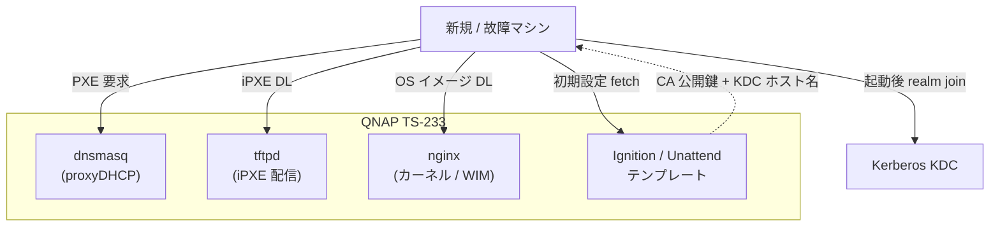

# homelab-pxe


iPXE による **OS ネットブート基盤**。Fedora CoreOS / Windows をネットワーク経由で配信し、
Kerberos 自動 join 込みで「壊れたら 5〜10 分で復活」を実現する。

- 📄 詳細要件: [`docs/requirements.md`](./docs/requirements.md)
- 🗺️ 全体像: [`../../docs/overview.md`](../../docs/overview.md)

---

## ✨ 提供価値

| 効果 | 内容 |
|------|------|
| 高速復元 | OS 破損 → ネット起動 → 10 分以内に Kerberos join 済み状態 |
| 状態の中央集約 | 物理マシンの個別状態を最小化 |
| 新規プロビジョニング自動化 | 新調達 PC を箱から出して PXE 1 回で完成 |
| 設定の Git 管理 | Ignition / unattend を IaC として管理 |

## 🏗️ アーキテクチャ



## 📦 想定ディレクトリ構成

```
modules/pxe/
├── README.md
├── docs/
│   ├── requirements.md
│   └── runbook.md            (将来)
├── compose/
│   └── pxe-stack.yml         (dnsmasq + tftpd + nginx)
├── ipxe/
│   ├── menu.ipxe             (ブートメニュー)
│   └── boot/                 (iPXE バイナリ)
├── images/
│   ├── fedora-coreos/
│   │   └── fetch.sh
│   └── windows/
│       └── README.md         (WIM 配置手順)
├── ignition/
│   └── fcos-base.bu          (Butane 入力)
└── unattend/
    └── windows-autounattend.xml
```

## 🚦 ステータス

- 要件定義: **v0.2** (公開品質)
- 実装: 未着手
- 次のマイルストーン: 配信方式 (netboot.xyz ベース) の最終確定 + PoC

## 🔗 関連モジュール

- [kerberos](../kerberos/) — Ignition / unattend に CA 公開鍵 / KDC ホスト名を埋め込む
- [autoupdate](../autoupdate/) — netboot.xyz / FCOS イメージのタグ pin
