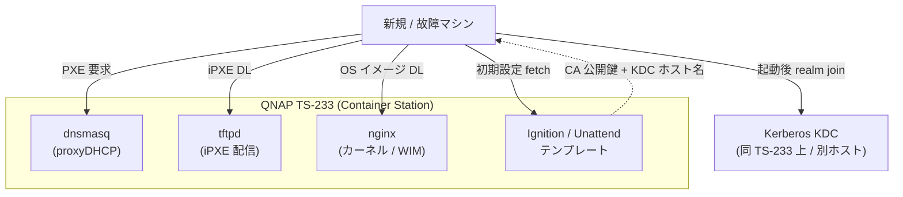

# PXE モジュール 要件定義書

最終更新: 2026-05-29 / ステータス: ドラフト v0.1

> 全体像とグローバル設計パラメータは [`../../../docs/overview.md`](../../../docs/overview.md) を参照。

---

## 1. 目的

- マシン故障 / OS 破損 / 新規プロビジョニング時に **ネットワーク経由で OS をブートし自動再構築**。
- 「壊れたら 5〜10 分で復活」を実現し、状態の所在を **「マシン」ではなく「KDC + PXE サーバ」** に寄せる。
- Kerberos / SSSD の自動 join まで含めて自動化し、再構築直後から既存ユーザでログイン可能にする。

## 2. 依存

| 種別 | 依存先 | 内容 |
|------|-------|------|
| 提供 | (全クライアント) | OS イメージ + 初期設定 |
| 受領 | kerberos | KDC ホスト名 / CA 証明書 / realm join 用パラメータ |
| 受領 | autoupdate | netboot.xyz / FCOS イメージのタグ pin |
| 外部 | DHCP | next-server オプション (or proxyDHCP) |
| 外部 | LAN VLAN | PXE 用セグメント (推奨) |

## 3. スコープ

### 3.1 In Scope
| ID | 項目 | 内容 |
|----|------|------|
| P-01 | DHCP | next-server / option 66/67 配布 (proxyDHCP モード可) |
| P-02 | TFTP | iPXE バイナリ (`undionly.kpxe`, `ipxe.efi`, `snponly.efi`) 配信 |
| P-03 | HTTP | カーネル / initramfs / squashfs / Ignition / unattend.xml の高速配信 |
| P-04 | iPXE メニュー | Win / FCOS / メモリ診断 / ローカルブート |
| P-05 | **Fedora CoreOS PXE** | Live PXE → Ignition で初期化 → Kerberos join 済みで完成 |
| P-06 | **Windows PXE** | WDS or iPXE + wimboot で WIM 配信、unattend.xml でドメイン参加 |
| P-07 | UEFI / Secure Boot | shim 経由 or 自前署名 |
| P-08 | 認証 / 制限 | LAN セグメント限定、VLAN 分離推奨 |

### 3.2 Out of Scope
- ベアメタル fleet management (MAAS / Foreman 相当)
- ディスクイメージのスナップショット配信 (Clonezilla 等)
- ARM クライアントの PXE (TS-233 自身は対象外)

## 4. 採用方式の選択 (TBD)

| 観点 | A. **netboot.xyz ベース** | B. MAAS | C. Foreman / Cobbler |
|------|--------------------------|---------|----------------------|
| 軽量さ | ◎ コンテナ 1〜2 個 | △ x86_64 中心、TS-233 不可 | △ 重い |
| Windows 配信 | ○ iPXE + wimboot | △ Linux 中心 | ○ |
| Fedora CoreOS | ◎ Live PXE 標準 | ○ | ○ |
| ARM64 (TS-233) | ◎ | × | △ |
| 学習コスト | 低 | 中 | 高 |
| 推奨 | **◎** | × | △ |

### 暫定推奨: **A. iPXE + netboot.xyz + 独自メニュー**

## 5. アーキテクチャ

> 初回ブート時に Ignition (FCOS) / unattend (Windows) が自動で realm join とハードウェアキー登録を行う。

## 6. 機能要件

| ID | 要件 | 受け入れ基準 |
|----|------|------------|
| FR-P-01 | PXE ブートでメニュー表示 | iPXE メニューが 30 秒以内に表示 |
| FR-P-02 | FCOS 無人インストール完了 | 起動後 SSH で `alice@` ログイン可能 (Kerberos 認証) |
| FR-P-03 | Windows 無人インストール完了 | 起動後ドメインユーザでサインイン可能 |
| FR-P-04 | Kerberos join 自動化 | Ignition / unattend に組込、手動操作ゼロ |
| FR-P-05 | UEFI Secure Boot 起動 | shim 経由で起動成功 |
| FR-P-06 | 既存 DHCP との共存 | dnsmasq proxyDHCP モード |
| FR-P-07 | ローカルブートフォールバック | メニューから既存 HDD ブートが選べる |

## 7. 非機能要件

| ID | 内容 |
|----|------|
| NFR-P-01 | 配信スループット ≥ 50MB/s (GbE LAN 上) |
| NFR-P-02 | FCOS インストール完了 ≤ 10 分 |
| NFR-P-03 | Windows インストール完了 ≤ 30 分 |
| NFR-P-04 | iPXE バイナリと FCOS イメージは外付け USB にミラー (TS-233 障害時の冗長化) |
| NFR-P-05 | Ignition / unattend に秘密鍵を含めない (信頼 CA 公開鍵のみ) |
| NFR-P-06 | TFTP / HTTP は LAN セグメント外からアクセス不可 |

## 8. 設計パラメータ

| 項目 | 暫定値 | 備考 |
|------|-------|------|
| PXE next-server | TS-233 (`kdc01.home.lab` と同居) | グローバル参照 |
| TFTP ルート | `/srv/tftp/` | |
| HTTP ベース URL | `http://pxe.home.lab/` | |
| FCOS ストリーム | `stable` | autoupdate と整合 |
| iPXE メニュータイムアウト | 30 秒 | 経過後ローカルブート |
| Secure Boot 署名 | TBD (shim+MOK / 自前) | |

## 9. リスクと対策

| # | リスク | 対策 |
|---|-------|------|
| R-P-1 | 家庭ルータ DHCP と衝突 | proxyDHCP モードで共存 (option 66 のみ追加配布) |
| R-P-2 | TS-233 1 台障害で復元基盤も失う | iPXE / FCOS イメージを外付け USB にミラー、緊急時はそこから起動 |
| R-P-3 | Secure Boot 鍵管理 | 自前 MOK enroll 手順を Runbook 化 |
| R-P-4 | Ignition に機微情報含めない | 公開鍵 / 信頼 CA のみ。秘密鍵は初回ブート後に取得 |
| R-P-5 | Windows ライセンス認証 | KMS or 直接認証。手順を Runbook 化 |
| R-P-6 | クライアント側 NIC が PXE 非対応 | iPXE バイナリを USB から chainload する手順を整備 |

## 10. 成果物 (Phase 3 完了時)

- 本 `docs/requirements.md`
- `compose/pxe-stack.yml`
- `ipxe/menu.ipxe` (メニュー定義)
- `ipxe/boot/` (バイナリ)
- `images/fedora-coreos/fetch.sh` (リリース取得スクリプト)
- `ignition/fcos-base.bu` (Butane 入力、Kerberos join 含む)
- `unattend/windows-autounattend.xml`
- `docs/runbook.md` (運用 / Secure Boot 設定 / トラブルシュート)

## 11. Open Design Decisions

### ODD-P01: PXE 配信スタックの選定
- **選択肢**: A. netboot.xyz ベース / B. MAAS / C. Foreman + Cobbler
- **推奨**: A (TS-233 ARM64 / 軽量 / Win 配信可)
- **ステータス**: 推奨提示済

### ODD-P02: Secure Boot サポート方針
- **選択肢**: A. shim 経由 (Fedora 公式署名) / B. 自前 MOK 登録 / C. Secure Boot 無効化
- **推奨**: A (運用負荷最小)
- **ステータス**: 議論中

### ODD-P03: Windows ライセンス認証
- **選択肢**: A. KMS サーバ自前運用 / B. プロダクトキー直接認証 / C. デジタルライセンス
- **推奨**: 利用台数次第。3 台以下なら B、それ以上なら A 検討
- **ステータス**: 運用者と要相談

### ODD-P04: 既存 DHCP との共存
- **選択肢**: A. proxyDHCP モード / B. PXE 用 VLAN 分離 / C. 既存 DHCP を置換
- **推奨**: A (家庭ルータの DHCP を温存)
- **ステータス**: 推奨提示済

### ODD-P05: イメージミラー保管先
- **選択肢**: A. TS-233 内のみ / B. 外付け USB に冗長化 / C. クラウド
- **推奨**: A + B (TS-233 障害時の復旧経路確保)
- **ステータス**: 議論中

---

## 12. 参考資料

- [iPXE Documentation](https://ipxe.org/docs)
- [netboot.xyz](https://netboot.xyz/)
- [Fedora CoreOS PXE Boot](https://docs.fedoraproject.org/en-US/fedora-coreos/bare-metal/)
- [Butane (Ignition 入力)](https://coreos.github.io/butane/)
- [wimboot (Windows PXE)](https://ipxe.org/wimboot)
- [Windows Autounattend.xml Reference](https://learn.microsoft.com/en-us/windows-hardware/customize/desktop/unattend/)

---

## 13. レビュー履歴

| 日付 | 版 | 変更点 |
|------|----|--------|
| 2026-05-29 | v0.1 | モジュール分離に伴う初版 |
| 2026-05-29 | v0.2 | 公開品質向上 (Mermaid 図、Open Design Decisions、参考資料) |
