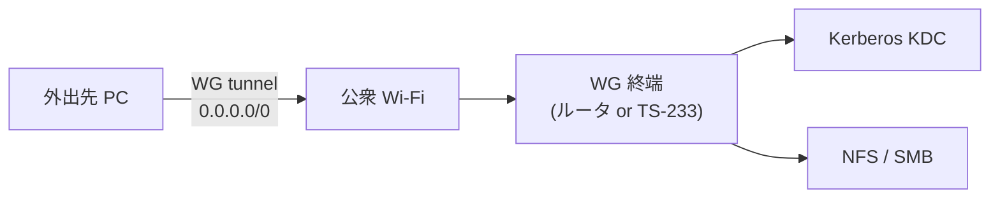

# homelab-wireguard


外出先 PC から自宅 LAN への **暗号化トンネル** (Road Warrior + Full Tunnel)。
公衆 Wi-Fi 上の盗聴対策、および自宅 KDC / NFS / SMB / DNS への透過アクセスを実現する。

- 📄 詳細要件: [`docs/requirements.md`](./docs/requirements.md)
- 🗺️ 全体像: [`../../docs/overview.md`](../../docs/overview.md)

---

## ✨ 提供価値

| 効果 | 内容 |
|------|------|
| 公衆 Wi-Fi 上の盗聴防止 | WireGuard が ChaCha20-Poly1305 で暗号化 |
| 内部リソースへのアクセス | 外出先から LAN 同等で KDC / SMB / NFS / 内部 Web に接続 |
| DNS 統一 | 自宅 DNS を経由するため内部ホスト名が解決可能 |
| 送信元 IP 固定 | 外向き通信が自宅 IP になり、自宅前提のフィルタに適合 |
| Kerberos 前提の確保 | 外出先からも TGT 取得経路を維持 |

## 🏗️ トポロジ



## 📦 想定ディレクトリ構成

```
modules/wireguard/
├── README.md
├── docs/
│   ├── requirements.md
│   └── router-setup.md       (機種別、将来)
├── compose/
│   └── wg-server.yml         (TS-233 終端時)
├── provision/
│   ├── generate-peer.sh
│   └── publish-peer-config.sh
└── clients/
    ├── windows/
    │   └── install-wg-client.ps1
    └── linux/
        ├── wg-pull.sh        (Kerberos 経由 pull)
        └── wg-quick-up.sh
```

## 🚦 ステータス

- 要件定義: **v0.2** (公開品質)
- 実装: 未着手
- 次のマイルストーン: WG 終端配置 (ルータ vs TS-233) の決定

## 🔗 関連モジュール

- [kerberos](../kerberos/) — トンネル先で TGT を取得
- [autoupdate](../autoupdate/) — WG コンテナの更新
